# AgentDevice - 智能终端开源项目

[English](README_EN.md) | [中文](README.md)

## 项目简介

AgentDevice 是一个完整的智能终端项目，通过软硬件协同设计、云边计算集成，实现多种智能应用场景。它可以作为低成本语音助手、经济实惠的教育机器人、本地识别动作仅在异常时报警的家庭监控设备，以及工业设备维护助手。

项目涵盖从硬件设计到软件实现的完整链条，包括自定义集成电路、PCB 布局、3D 打印外壳，以及基于 ESP-IDF 的嵌入式软件开发。

## 主要特性

### 硬件设计
- **自定义集成电路**：自主设计的电路板，支持多种传感器和接口
- **PCB 设计**：完整的 Gerber 文件，可直接用于 PCB 制造
- **3D 打印外壳**：模块化外壳设计，包括按键、屏幕盖等组件

### 软件功能
- **按键拍照**：支持按键触发拍照功能
- **表情设置**：可自定义表情包显示，支持多种表情切换
- **电量显示**：实时监测电池电量并显示
- **音量控制**：音量加减按键控制
- **IoT 控制设备**：集成物联网功能，支持温湿度传感器等设备控制
- **MCP 控制设备**：通过 MCP 协议控制外部设备

## 项目结构

```
AgentDevice/
├── LICENSE                 # Apache 2.0 许可证
├── README.md              # 项目说明文档（中文）
├── README_EN.md           # 项目说明文档（英文）
└── docc/               # 小e智能终端相关文件
    ├── 3D外壳文件/        # 3D 打印 STL 文件
    ├── 原理图及PCB文件/   # 电路原理图和 PCB Gerber 文件
    ├── 小e-按键拍照/     # 按键拍照功能实现
    ├── 小e-表情设置/     # 表情设置功能实现
    ├── 小e-电量显示/     # 电量显示功能实现
    ├── 小e-音量加减/     # 音量控制功能实现
    ├── 小e-iot控制设备/  # IoT 设备控制功能实现
    └── 小e-mcp控制设备/  # MCP 设备控制功能实现
```

## 硬件设计详解

### 电路原理图
项目包含完整的电路原理图 PDF 文件，位于 `docc/原理图及PCB文件/原理图.pdf`。

**原理图预览：**
[查看完整原理图](docc/原理图及PCB文件/原理图.pdf)

### PCB 设计
PCB Gerber 文件位于 `docc/原理图及PCB文件/Gerber_PCB/` 目录，包含：
- 顶层和底层铜箔层
- 丝印层
- 阻焊层
- 钻孔文件
- 其他制造文件

**PCB下单必读：**
[PCB下单说明](docc/原理图及PCB文件/Gerber_PCB/PCB下单必读.txt)

### 3D 外壳
3D 打印文件位于 `docc/3D外壳文件/` 目录，包含：
- 外壳主体 (外壳1.STL)
- 按键组件 (按键.STL, 按键2.STL, 按键3.STL, 按键4.STL)
- 屏幕盖板 (装配体2 - 屏幕盖-1.STL)
- 盖板 (装配体2 - 盖-1.STL)

**3D 外壳渲染图：**
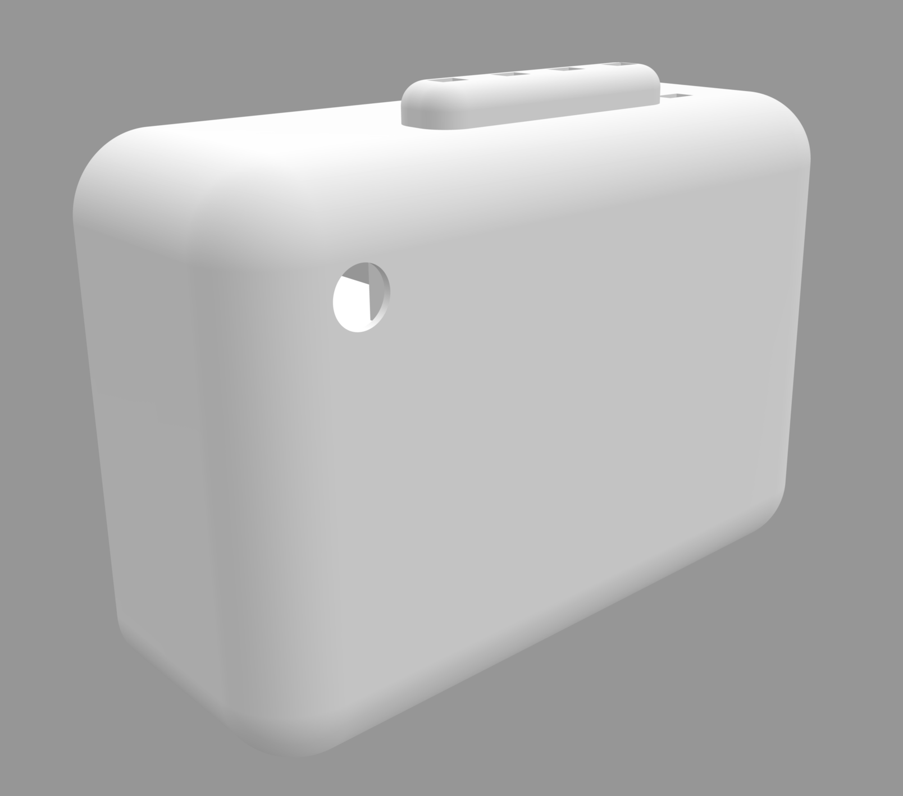
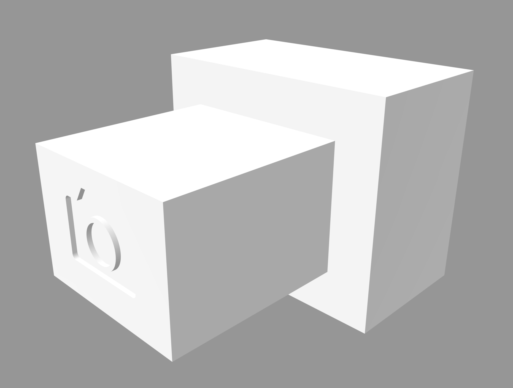


## 软件功能实现

### 按键拍照功能
支持通过按键触发拍照，集成摄像头模块。实现步骤包括：
1. 配置拍照引脚
2. 添加拍照头文件
3. 初始化按键拍照监测器
4. 实现拍照方法

**演示视频：**
<video width="600" controls>
  <source src="docc/小e-按键拍照/video/video1.mp4" type="video/mp4">
  您的浏览器不支持视频标签
</video>

**配置截图：**
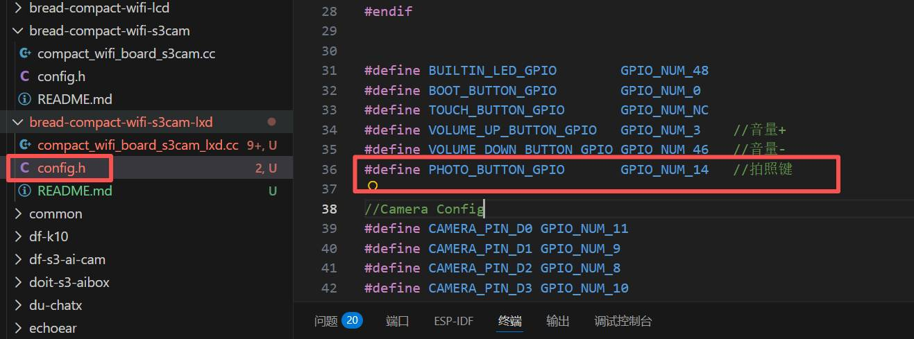
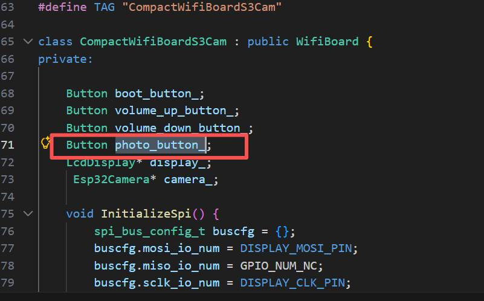
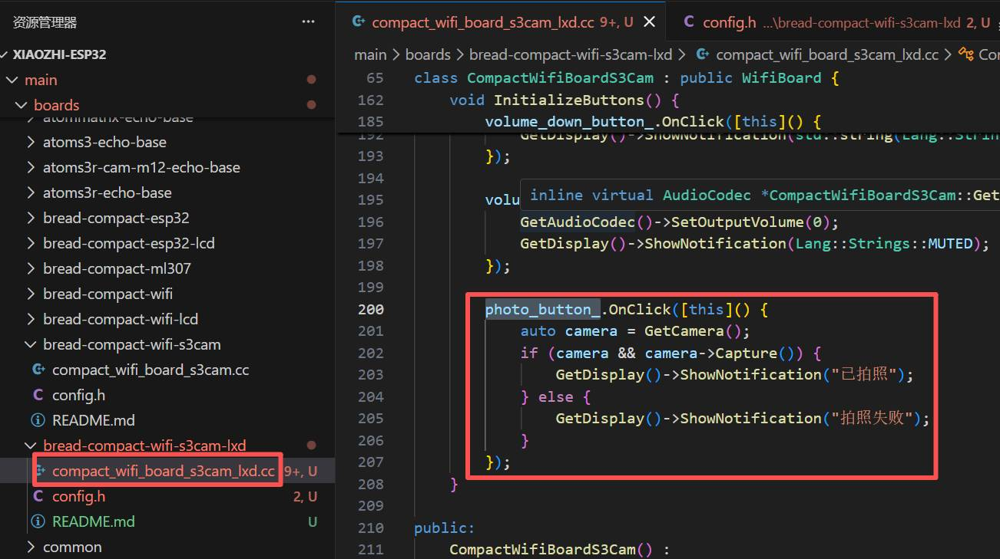
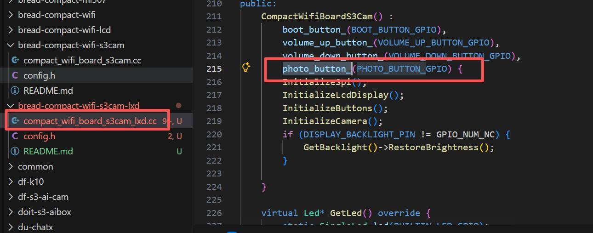

### 表情设置功能
支持自定义表情包显示：
1. 生成或下载表情包图片
2. 将图片转换为 C 数组格式
3. 添加表情数据到代码
4. 配置显示参数

**表情包示例：**
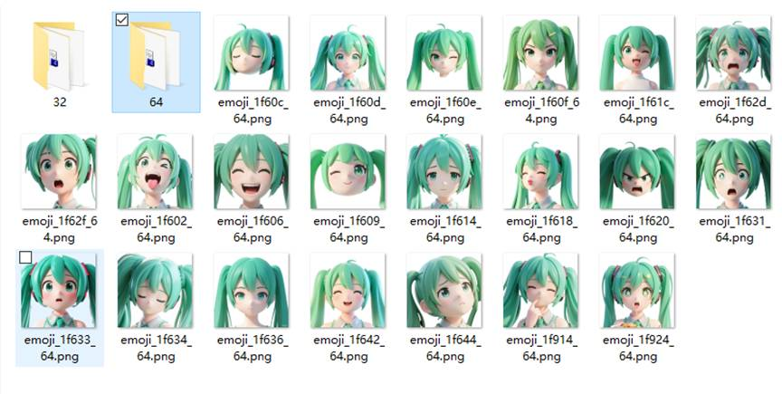
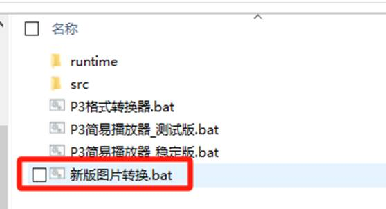
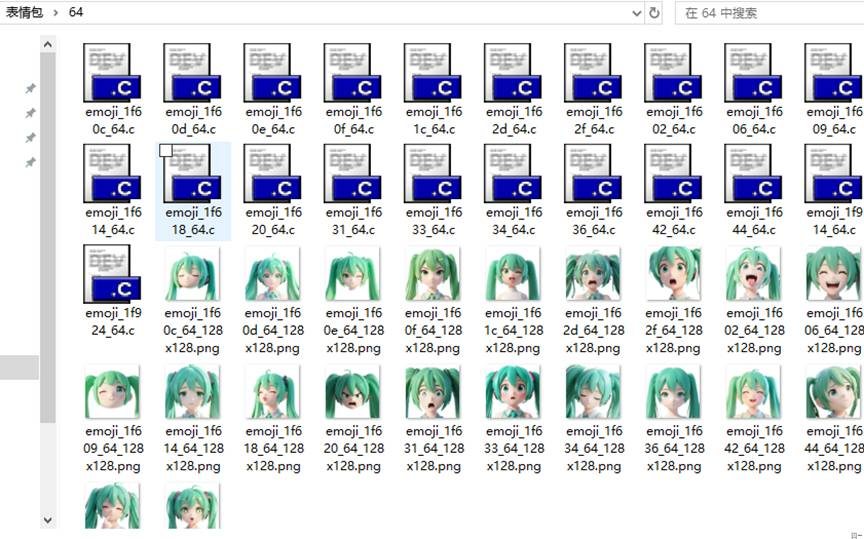
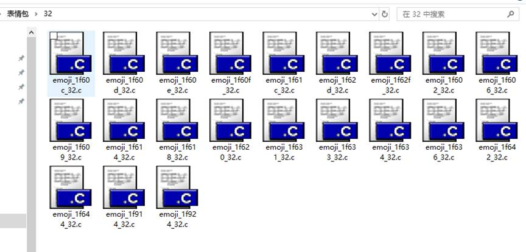
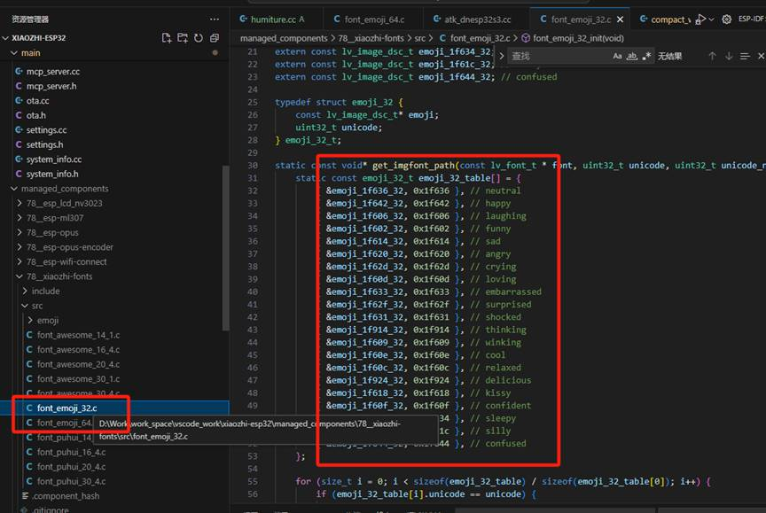
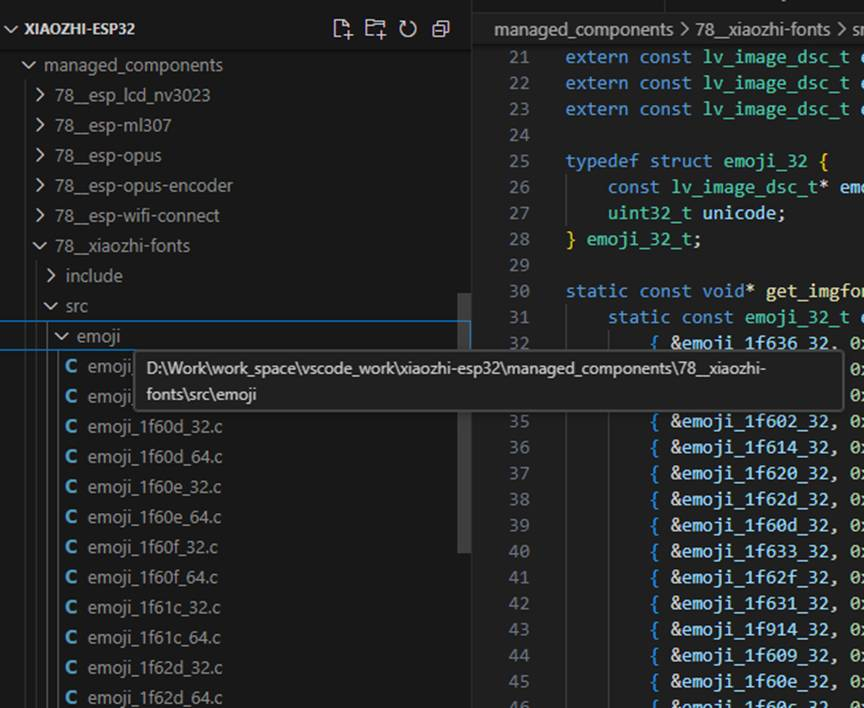
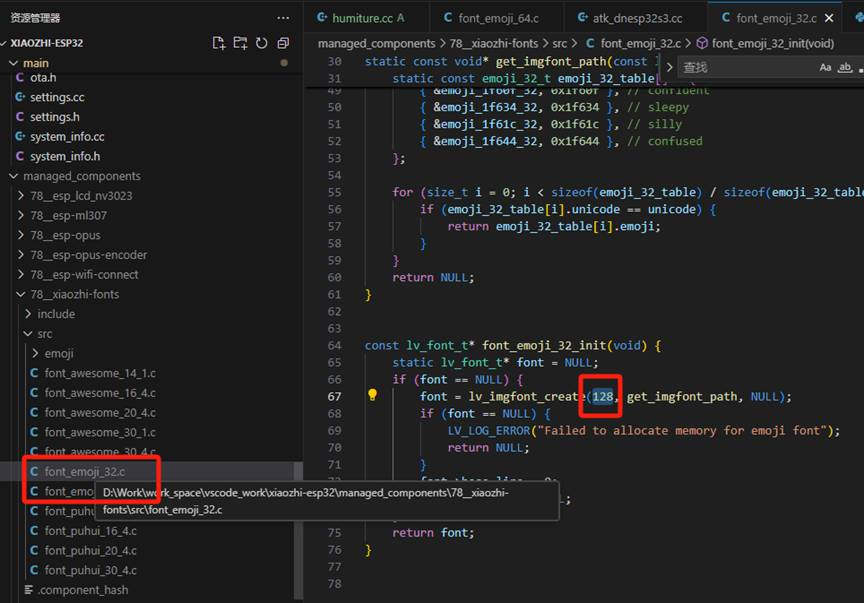

### 电量显示功能
实时监测电池电量：
1. 配置 ADC 引脚
2. 添加电量监测头文件
3. 初始化 ADC 监测器
4. 实现电量获取函数

**配置截图：**
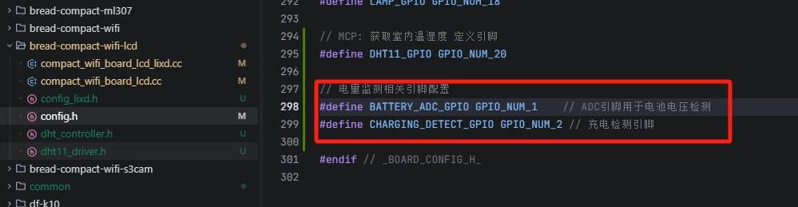
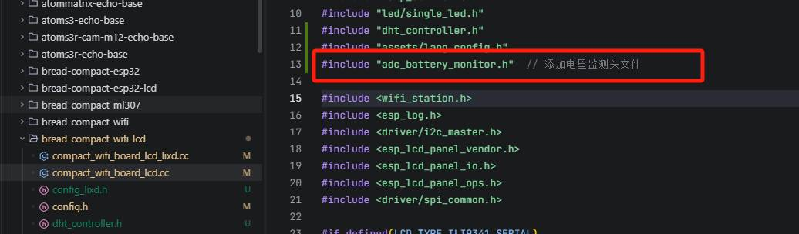
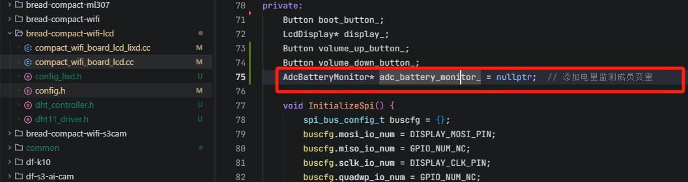
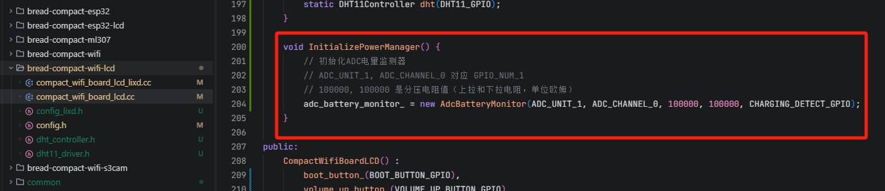
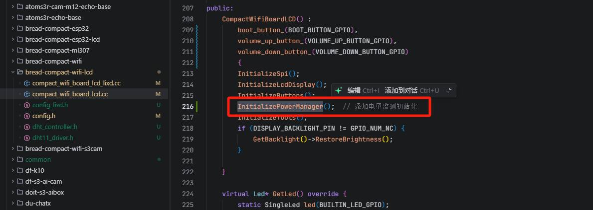


### 音量控制功能
音量加减按键控制：
1. 定义音量控制引脚
2. 初始化按钮函数
3. 修改构造函数
4. 添加相关头文件

**演示视频：**
<video width="600" controls>
  <source src="docc/小e-音量加减/video/video1.mp4" type="video/mp4">
  您的浏览器不支持视频标签
</video>

**配置截图：**


### IoT 控制设备
集成物联网功能，支持多种传感器：
- 温湿度传感器示例
- 自定义设备类实现
- 属性定义和回调函数

**实现截图：**
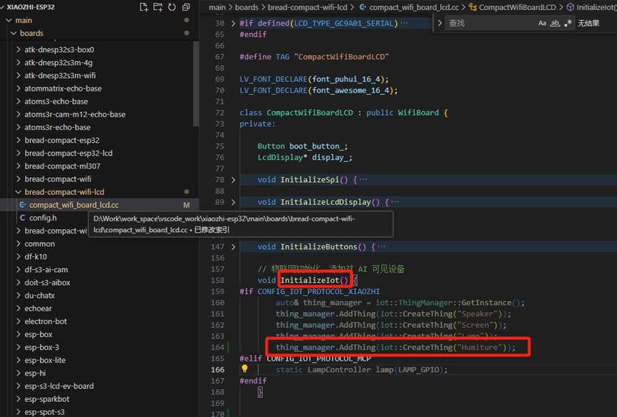
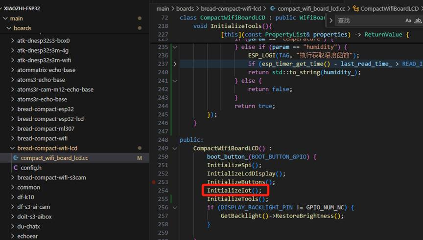

### MCP 控制设备
通过 MCP 协议控制外部设备：
- 设备初始化
- 通信协议实现
- 数据传输和控制

**实现截图：**
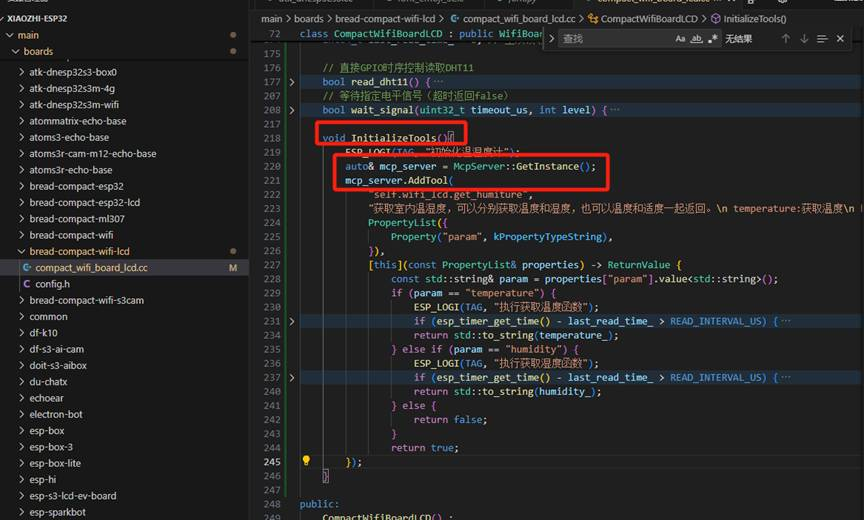
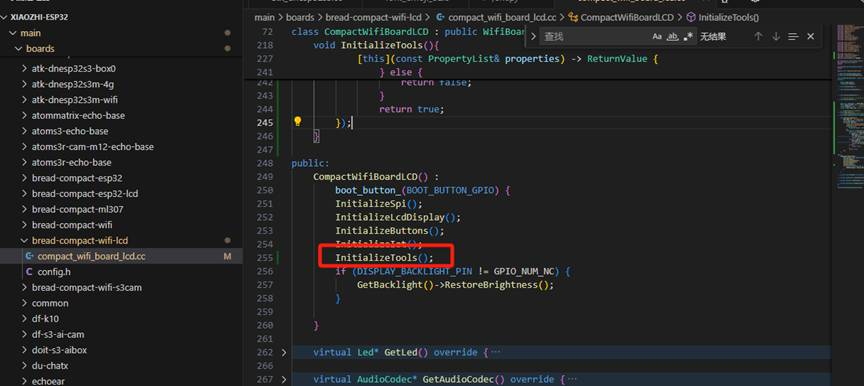

## 快速开始

### 硬件准备
1. 下载并打印 3D 外壳文件
2. 使用 Gerber 文件制作 PCB
3. 购买所需电子元件
4. 焊接并组装硬件

### 软件设置
1. 安装 ESP-IDF 开发环境
2. 克隆项目：`git clone https://github.com/your-repo/AgentDevice.git`
3. 进入项目目录：`cd AgentDevice`
4. 配置项目：`idf.py menuconfig`
5. 编译并烧录：`idf.py build flash`

### 功能测试
按照各功能模块的 README 逐步实现和测试。

## 安装和使用

### 环境要求
- ESP-IDF 开发环境
- 3D 打印机（用于外壳制作）
- PCB 制造服务（用于电路板）

### 编译和烧录
1. 安装 ESP-IDF
2. 克隆项目仓库
3. 配置项目参数
4. 编译固件
5. 烧录到设备

### 硬件组装
1. 根据 Gerber 文件制作 PCB
2. 使用 3D 打印机制作外壳
3. 焊接元件
4. 组装完成

## 贡献指南

欢迎社区贡献！请遵循以下步骤：
1. Fork 项目
2. 创建功能分支
3. 提交更改
4. 发起 Pull Request

## 许可证

本项目采用 Apache License 2.0 许可证。详见 [LICENSE](LICENSE) 文件。

## 联系我们

如有问题或建议，请通过以下方式联系：

- **GitHub Issues**：[提交问题](https://github.com/your-repo/AgentDevice/issues)
- **官网**：[https://ai-evbot.cn](https://ai-evbot.com)
- **微信联系人二维码**：
  
- **视频号二维码**：
  
- **抖音号二维码**：
  
- **B站二维码**：
  
- **小红书二维码**：
  

### 赞助支持
如果喜欢这个项目给点个🌟，可以解锁更多内容和开源代码

[GitHub Star](https://github.com/EvMatrix/AgentDevice/stargazers)

---

**AgentDevice** - 让智能终端触手可及！
