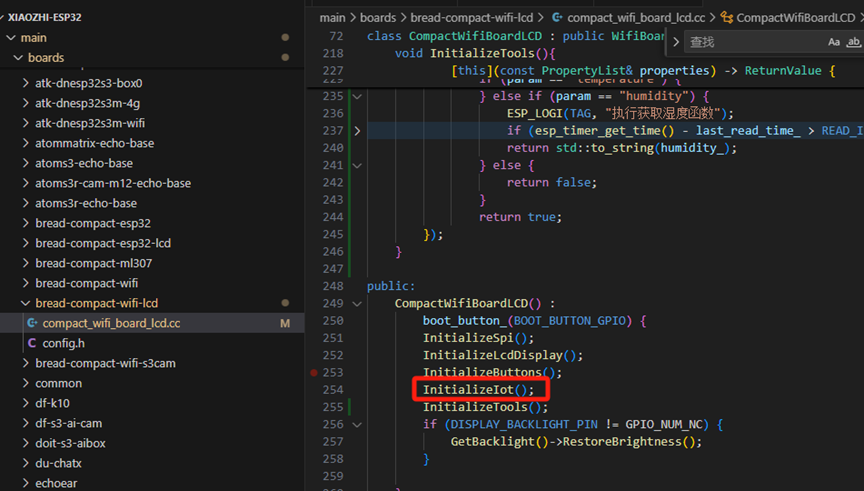
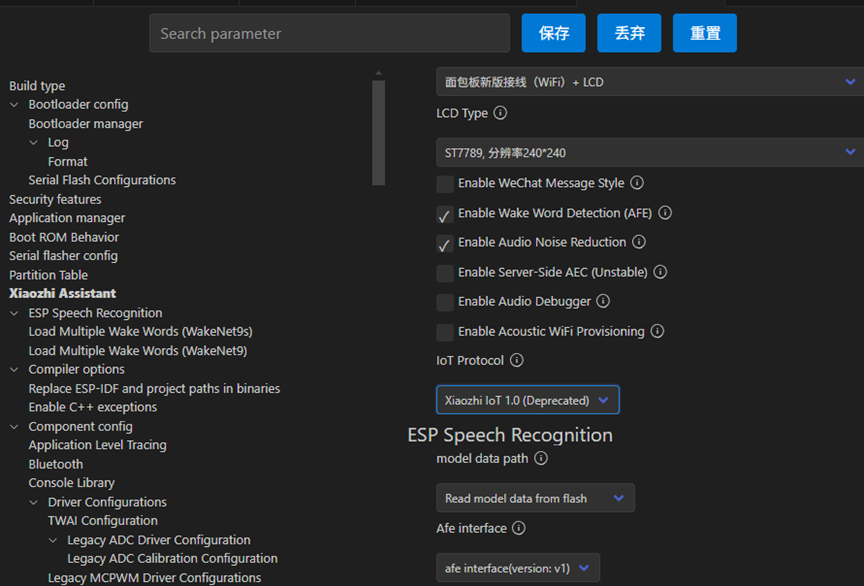

# 电量监测功能实现步骤
```
我这里已接入温度传感器为例
```
## 1.按照如下规范创建并编写iot工具类
```

    Humiture() : Thing("Humiture", "温湿度计") {
        // 初始化GPIO
        gpio_config_t config = {
            .pin_bit_mask = 1ULL << dht_gpio_,
            .mode = GPIO_MODE_OUTPUT_OD,
            .pull_up_en = GPIO_PULLUP_ENABLE,
        };
        gpio_config(&config);

        // 定义属性
        properties_.AddNumberProperty(
            "temperature", 
            "现在室内温度是多少",
            [this]() {
                ESP_LOGI(TAG, "执行获取温度函数");
                if (esp_timer_get_time() - last_read_time_ > READ_INTERVAL_US) {
                    read_dht11();  // 仅在数据过期时读取
                }
                return temperature_; 
            }
        );
        properties_.AddNumberProperty(
            "humidity", 
            "现在室内湿度是多少",
            [this]() { 
                ESP_LOGI(TAG, "执行获取湿度函数");
                if (esp_timer_get_time() - last_read_time_ > READ_INTERVAL_US) {
                    read_dht11();
                }
                return humidity_;
            }
        );
        // 首次强制读取
        read_dht11();
    }
};

} // namespace iot

DECLARE_THING(Humiture);

```
## 2.在对应的板子归类代码下初始化

### 注意这里看下加入初始化没

## 3.烧录时记得修改配置

## 4.到此大功告成！！！