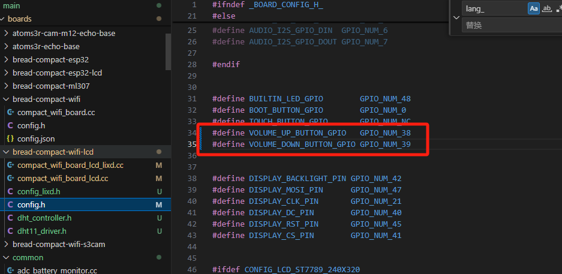
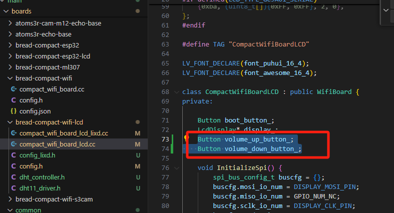
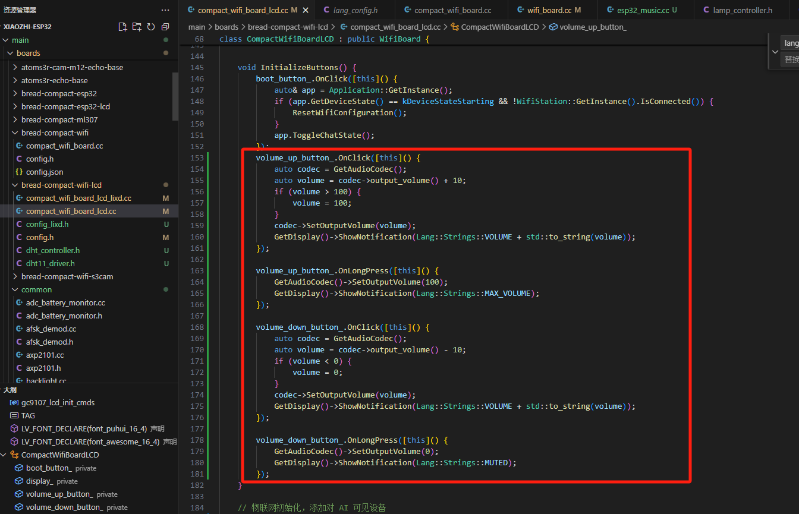
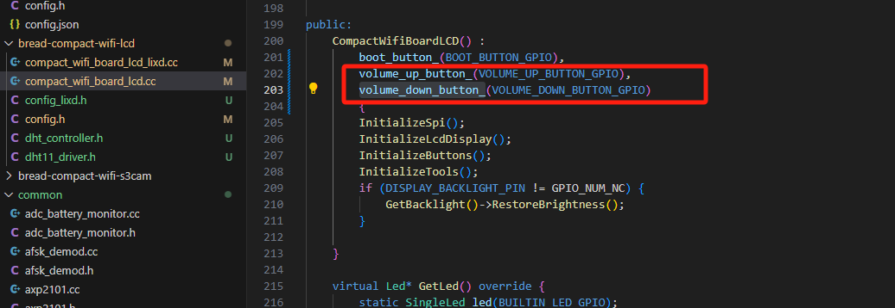
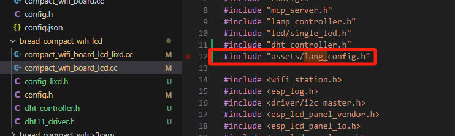

# 电量监测功能实现步骤
<video width="600" controls>
  <source src="video/video1.mp4" type="video/mp4">
  您的浏览器不支持视频标签
</video>

## 1.在config.h中定义音量加减的引脚

## 2.在对应的板子下面的.cc文件中定义变量

## 3.初始化按钮函数

## 4.类的构造函数修改

## 5.头文件增加
